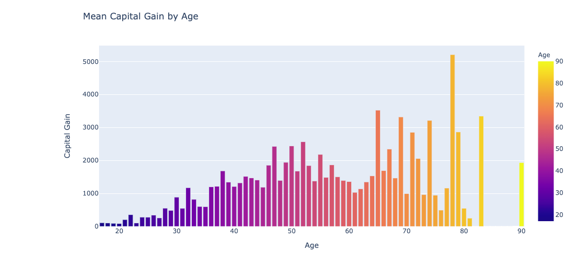
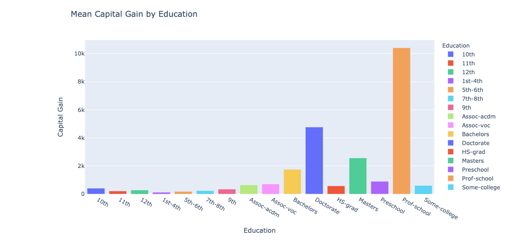
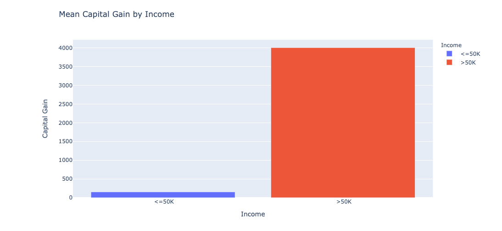
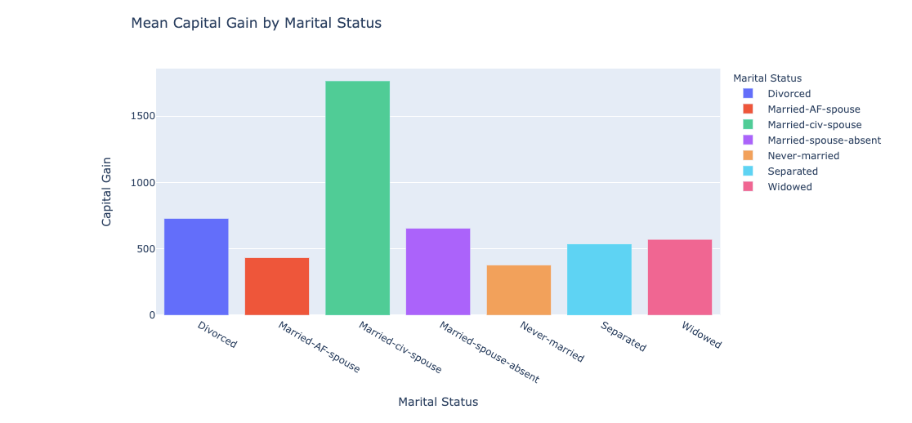
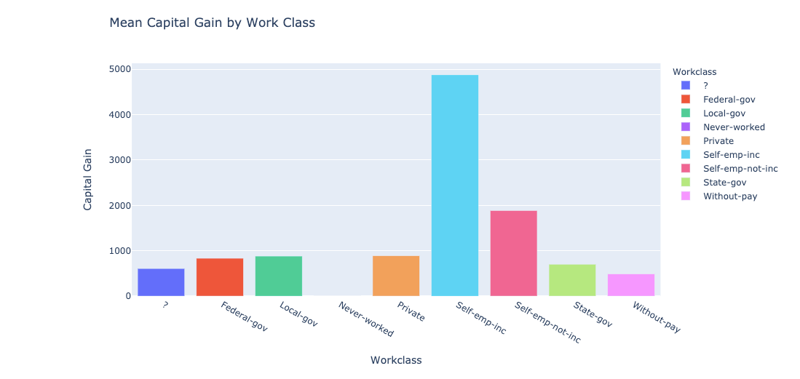
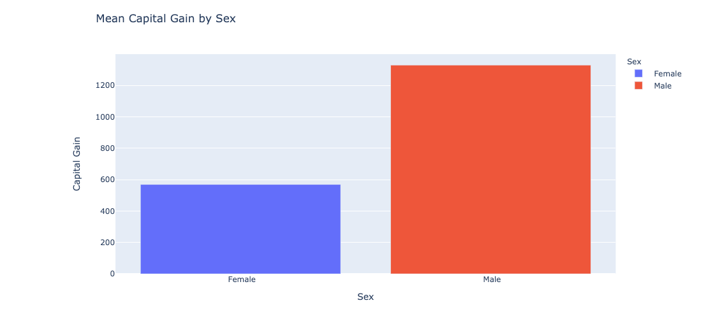

# Income_Classification
## Introduction
Given US Census Data, this project sets out to accurately classify a persons income based upon selected features. The data is taken from the 1994 Census for the purposes of classifying income as being greater or less than 50 thousand dollars annually. In today's dollars adjusting for inflation, the 50K marker woud be equivalent to approximately 86K. The data was extracted by Barry Becker and donated to the UCI Machine Learning repository, from where I obtained the data.
The data set consists in 48,842 instances, and each instance posesses a mixture of continuous and discrete data. Two thirds of the the data is composed of the training set and the remaining third is the test set:

training set = 32,561 instances

test set = 16,281 instances

## Technical Requirements, Libraries & Packages
### Array and Dataframe processing:
Pandas  
Numpy  

### Visualization:
Matplotlib  
Seaborn 
Plotly  

### Model Implementation:
Sklearn RandomForrest Classifier

### Metrics:
Sklearn confussion_matrix 
classification_report 
accuracy_score

### Scaling and Preprocessing:
sklearn standardScaler 
LabelEncoder

### Model Training and Testing:
sklearn train_test_split

## Process

## Exploratory Data Analysis

## Modeling
Possible Models to explore (minimum of four):
- Logistic Regression
- K Nearest Neighbors
- Trees (decision tree, bagged trees, random forest)
- Boosting models (adaboost, gradient boost, xgboost)
- Support vector machines 
- Naive bayes
